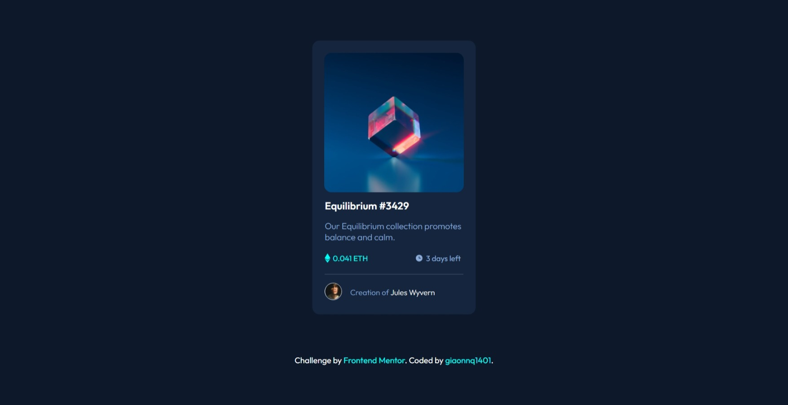
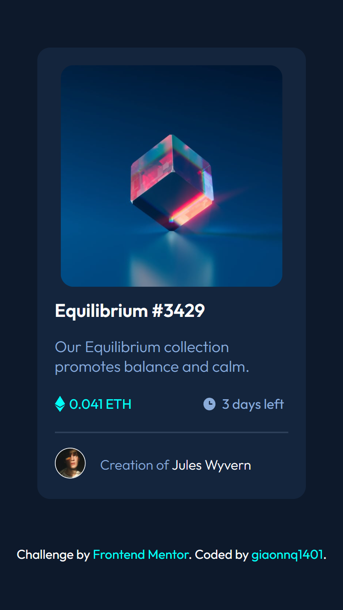

# Frontend Mentor - NFT preview card component solution

This is a solution to the [NFT preview card component challenge on Frontend Mentor](https://www.frontendmentor.io/challenges/nft-preview-card-component-SbdUL_w0U). Frontend Mentor challenges help you improve your coding skills by building realistic projects. 

## Table of contents

- [Overview](#overview)
  - [Screenshot](#screenshot)
  - [Links](#links)
- [My process](#my-process)
  - [Built with](#built-with)
- [Author](#author)

## Overview

### Screenshot

### Links

- Solution URL: [Github](https://github.com/giaonnq1401/FrontendMentor-NTF-preview-card-component-main)
- Live Site URL: [Github Page](https://giaonnq1401.github.io/FrontendMentor-NTF-preview-card-component-main/)
- Frontend Mentor Challenge - [NTF preview card component]()

## My process

### Built with

- Semantic HTML5 markup
- CSS custom properties
- Flexbox

## Author

- Github - [giaonnq1401](https://github.com/giaonnq1401)
- Frontend Mentor - [giaonnq1401](https://www.frontendmentor.io/profile/giaonnq1401)